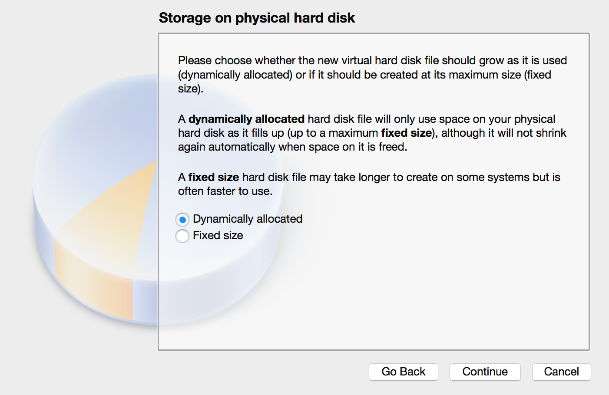
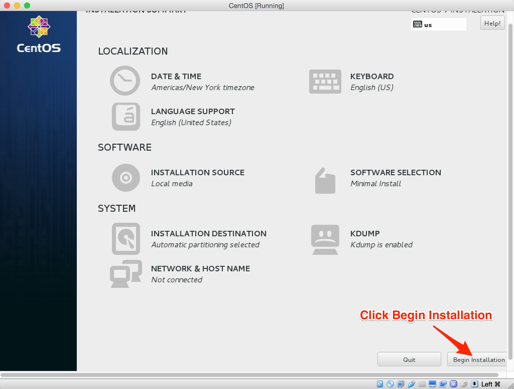

# How to set your Linux virtual machine
This chapter will introduce how to set up a Linux(CentOS) virtual machine in your own laptop.

#### Softeware needed
There are several free virtual machine softwares while I recommend you below two:  
- [vmplayer](https://www.vmware.com/products/player/playerpro-evaluation.html)
- [VirtualBox](https://www.virtualbox.org/wiki/Downloads)

#### Linux Distribution Selection
I recommend you use CentOS 7 for you learning  
  
[CentOS 7 Img Download](http://isoredirect.centos.org/centos/7/isos/x86_64/CentOS-7-x86_64-Minimal-1611.iso)

This chapter will take `VirtualBox` for virtual machine software and `CentOS 7` for OS as an example.

#### Installation
Just follow the guidance of the software.  

#### How to install your Linux

Here we just install a minimal system **without any graph interface**. In this way, you will be forced to only use commands for all tasks.  

- Open your virtualbox  
- New a virtual machine  
  

- Name it whatever you want and select the type and version of OS you want to install

- Assign the amount of memory you want to assign to the virtual system. I think 768MB is enough for our learning.

- Create a virtual hard disk for your system(this will be a file/or several files stored on your physical disk which contain(s) all things of your VM)

- Choose virutal disk type(as we only use this VM on VirtualBox, we can use the default type)

- Always choose `Dynamically allocated`. In this way, the VM disk file will start with a very small size and increases to a top size you will specific in the next step.

- Choose the `max size` of your VM disk

*Now we have a virtul machine without any OS in it, which means we cannot communicate with it. Let's install CentOS 7 in this VM.*  

- Right click the VM you just created and open `settings` panel.

- Change to `Storage` tap and set the `Controller:IDE` to the path where you store your [CentOS img](#img) you just downloaded.

- Now you can start your VM. Select the VM and click `Start` at the top right.

- After a few seconds, the installation process will begin.
- Use your keyboard `Up` and `Down` and choose `Install CentOS 7` and click `Return` button on your keybaord.

- Select `INSTALLATION DESTINATION` and do some settings.

- Select `AUtomatically configure partitioning` on the bottom and click `Done` on the very top.

- Click `Begin Installation`

- Set password for your root user(**root is the super Administrator user accound and has full permission on your Linux**)

- Set the password for root.

- Create another user account if you want.

- Finish your configuration

- Reboot

- Now you have your own Linux, use your account settle just now and you can practise your Linux skills.

